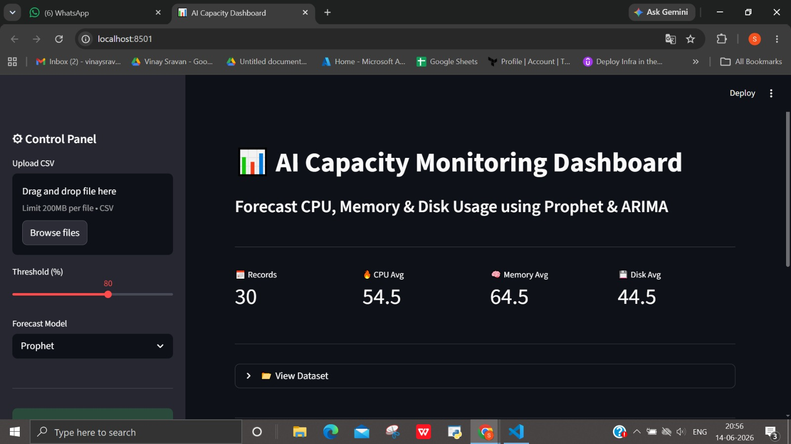
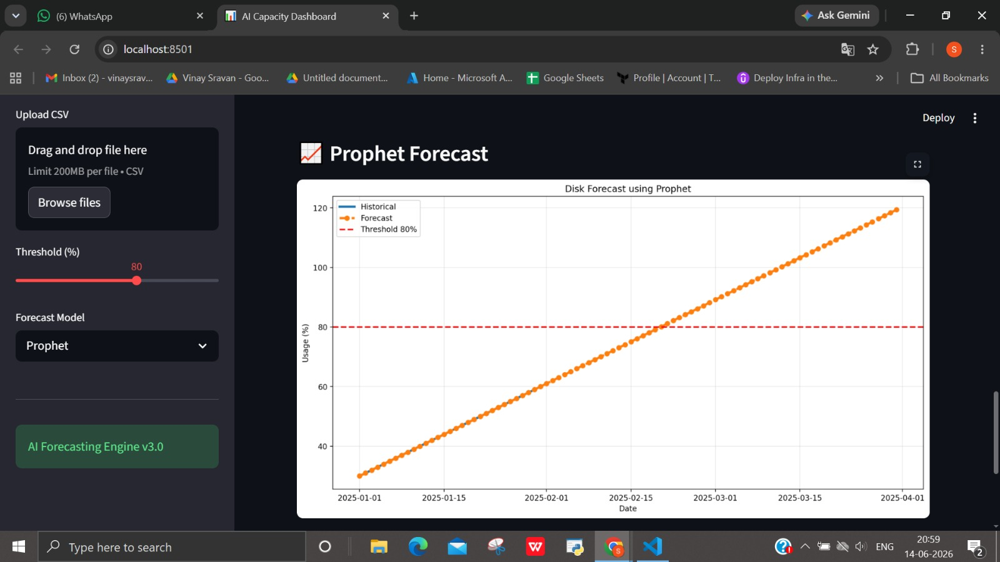
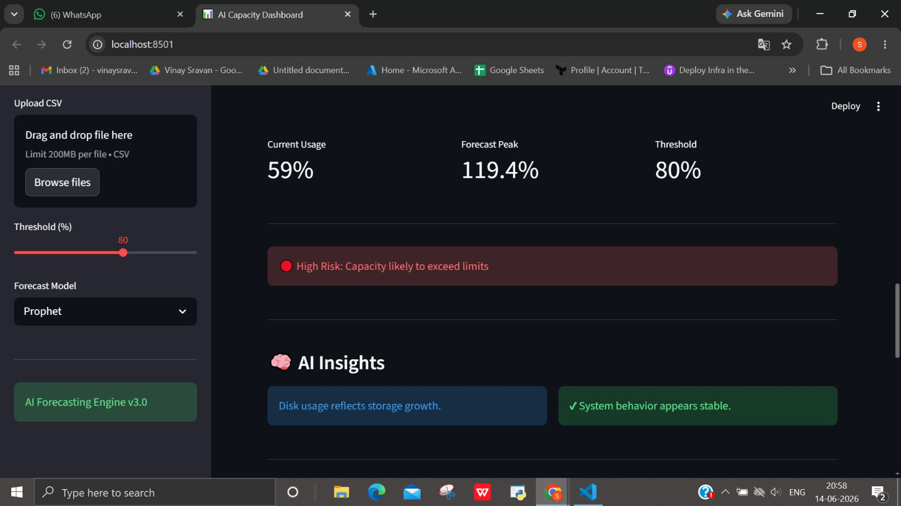
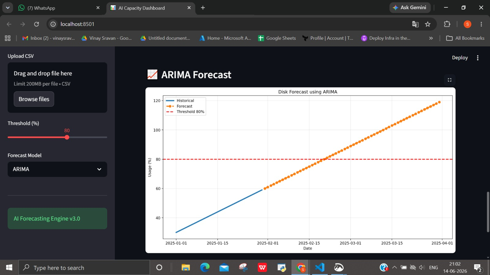
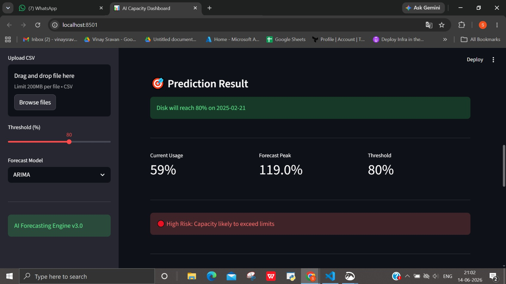

# 🚀 IM-02 AI Capacity Forecaster

An AI-powered Streamlit dashboard that forecasts CPU, Memory, and Disk utilization using **Prophet and ARIMA models**, with built-in anomaly detection and risk analysis.

The system helps organizations predict future capacity usage, detect abnormal behavior, and avoid infrastructure bottlenecks.

---

# 📌 Problem Statement

Modern infrastructure systems require proactive capacity planning to avoid performance degradation.

This project solves this by:

- Forecasting resource utilization trends
- Detecting anomalies in forecast behavior
- Identifying when thresholds will be breached
- Providing AI-driven insights for decision-making

---

# ✨ Features

## 📊 AI Forecasting Engine

Supports two forecasting models:

- Prophet (time-series forecasting)
- ARIMA (statistical forecasting)

Forecasts:

- CPU Usage
- Memory Usage
- Disk Usage

---

## 🔍 AI Query System

Users can ask natural language questions like:

- When will CPU usage hit 80%?
- Predict Disk usage growth
- Forecast Memory utilization

System automatically detects the metric (CPU / Memory / Disk).

---

## 🚨 Anomaly Detection

Built-in logic detects abnormal patterns:

- Rolling mean deviation (Prophet)
- Statistical deviation (ARIMA)
- Forecast instability detection

---

## 📈 Risk Analysis

Automatically classifies system health:

- 🟢 Low Risk → Safe usage
- 🟠 Medium Risk → Approaching threshold
- 🔴 High Risk → Exceeds capacity limit

---

## 📥 Export Feature

Download full forecast results as CSV:

- Forecast dates
- Predicted values
- Anomaly flags

---

## 🧠 AI Insights Panel

Provides intelligent explanations for:

- CPU behavior
- Memory usage patterns
- Disk growth trends
- Forecast anomalies

---

# 📸 Screenshots

## Dashboard Overview


---

## Prophet Forecast


---

## Prophet Output


---

## ARIMA Forecast


---

## ARIMA Output


---

# 🏗 Architecture

```text
CSV Input
   ↓
Data Validation
   ↓
Metric Detection (CPU / Memory / Disk)
   ↓
Forecast Engine
   ├── Prophet Model
   └── ARIMA Model
   ↓
Anomaly Detection
   ↓
Risk Analysis
   ↓
Streamlit Dashboard
   ↓
CSV Export
🛠 Technology Stack
Layer	Technology
Frontend	Streamlit
Forecasting	Prophet
Statistical Model	ARIMA
Data Processing	Pandas
Visualization	Matplotlib
ML Support	NumPy
Testing	Pytest
Language	Python
📂 Project Structure
IM-02-Capacity-Forecaster/

├── app.py
├── requirements.txt
├── README.md
├── prompts.md
├── ai_usage_note.md
│
├── data/
│   └── metrics.csv
│
├── tests/
│   └── test_app.py
│
├── screenshots/
│   ├── Prophet_dashboard.png
│   ├── Prophet_graph.png
│   ├── Prophet_output.png
│   ├── ARIMA_graph.png
│   └── ARIMA_output.png
│
├── resumes/
│   ├── Member1.pdf
│   ├── Member2.pdf
│   ├── Member3.pdf
│   └── Member4.pdf
│
└── outputs/
    └── forecast.csv
⚙️ Installation
git clone https://github.com/rekha2756/Capacity_Forecaster.git
cd Capacity_Forecaster
pip install -r requirements.txt
streamlit run app.py
📄 Input Format

Upload a CSV file with:

Column	Description
Date	Metric date
CPU	CPU usage (%)
Memory	Memory usage (%)
Disk	Disk usage (%)

Example:

Date,CPU,Memory,Disk
2025-01-01,40,60,70
2025-01-02,42,62,72
📊 Sample Output
Forecast Date | Predicted Usage | Anomaly
2025-05-01    | 78.4            | False
2025-05-02    | 82.1            | True
🚀 How It Works
Upload CSV file
Choose model (Prophet / ARIMA)
Enter query (CPU / Memory / Disk)
Set threshold
Run forecast
View risk + insights
Download report
🎯 Risk Classification
Level	Meaning
🟢 Low	Safe system
🟠 Medium	Approaching threshold
🔴 High	Capacity risk detected
🧪 Testing

Run tests:

pytest tests/test_app.py

Test coverage includes:

Forecast validation
Anomaly detection
Threshold breach logic
Output structure validation
📹 Demo Video

https://www.loom.com/share/63b136753290416caf0f323d986444c8

🔗 GitHub Repository

https://github.com/rekha2756/Capacity_Forecaster

🤖 AI Capabilities Demonstrated
Time Series Forecasting
Prophet & ARIMA Models
Capacity Planning
Anomaly Detection
Risk Analysis
Predictive Analytics
Decision Support System
📦 Deliverables
Source Code
README
AI Usage Note
Prompt Documentation
Test Cases
Sample Data
Screenshots
Resume PDFs
Demo Video
🤝 AI Usage Disclosure

AI tools were used for:

Streamlit UI development
Forecasting logic implementation
ARIMA integration
Anomaly detection logic
Test case generation
Documentation support

All outputs were reviewed and validated by the team.

📜 License

This project is for academic and educational purposes only.
